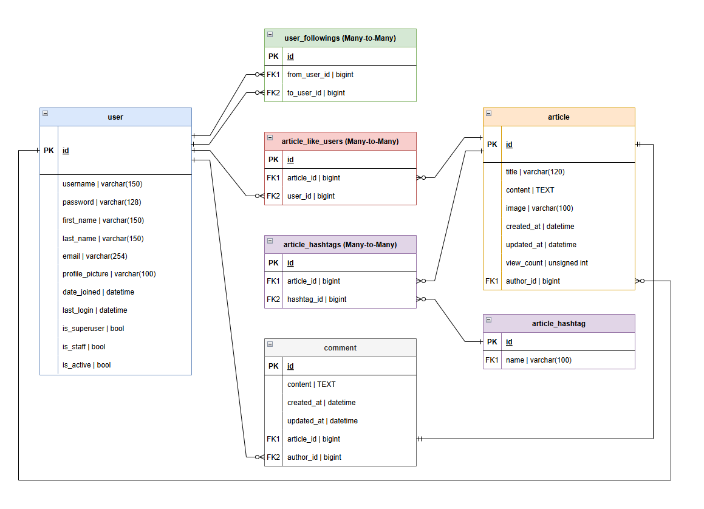

# 중고거래 사이트 - 오렌지 마켓🍊
오렌지 마켓은 기본적인 **중고물품 거래** 기능을 제공하는 웹 애플리케이션입니다. 사용자들은 회원가입, 로그인, 물품 등록, 찜하기, 해시태그를 이용한 검색 기능을 제공하며, 인기도순 및 최신순으로 물품을 정렬할 수 있습니다. 또한, 각 유저의 프로필에서 등록한 물품, 찜한 상품, 팔로우 기능 등을 이용할 수 있습니다.


<br><br>

## 목차
<div style="border: 1px solid #333; padding: 10px; background-color: #f9f9f9; width: 250px;">

- [프로젝트 개요](#프로젝트-개요)
- [주요기능 소개](#주요기능-소개)
- [설치 및 실행](#설치-및-실행)
- [데이터베이스 구조](#데이터베이스-개요요)
- [기능별 페이지](#기능별-페이지)
- [프로세스 플로우](#프로세스-플로우)
- [ERD](#ERD)
- [트러블슈팅](#트러블슈팅)
- [코드 리뷰](#코드-리뷰-(추가-개선점-회고))

</div>

<br><br>

## 프로젝트 개요
- 프로젝트명 : SpartaMarket (부트캠프 커리큘럼)
- 개발자 : 박성진
- 개발 기간 : 2024.12.20 - 2024.12.26
- 사용 언어 및 기술 :
```
Frontend: HTML, CSS
Backend: Django(MVT), Python
DB: SQlite3
Community: Git, GitHub, Figma, draw.io
```

## 주요기능 소개

### 회원 기능

- **회원가입 / 로그인 / 로그아웃**
    - 유저는 username(ID)과 비밀번호로 회원가입 및 로그인을 할 수 있습니다.
    - 로그인 후에는 로그아웃 기능을 제공하여, 언제든지 로그아웃할 수 있습니다.

- **프로필 페이지**
    - 각 유저마다 **프로필 페이지**가 제공됩니다.
    - 프로필 페이지에서는 **유저명**, **가입일**, **내가 등록한 물품 목록**을 확인할 수 있습니다.
    - 유저는 **프로필 사진**을 업로드하여 자신의 사진을 설정할 수 있습니다. 업로드하지 않으면 기본 프로필 사진이 설정됩니다.
    - 유저는 **팔로우** 및 **팔로워** 기능을 이용할 수 있으며, 팔로우 및 팔로워 수를 확인할 수 있습니다.

### 유저 기능

- **프로필 페이지**
    - 각 유저의 프로필 페이지에서는 해당 유저가 등록한 물품을 확인할 수 있습니다.
    - 유저는 **팔로우** 버튼을 클릭하여 다른 유저를 팔로우 할 수 있습니다.
    - 팔로워와 팔로우의 수를 확인할 수 있습니다.

### 게시 기능

- **상품 등록, 수정, 삭제**
    - 유저는 상품을 자유롭게 **등록**, **수정**, **삭제**할 수 있습니다.
    - 등록된 상품은 물품 목록과 물품 디테일 페이지에서 볼 수 있습니다.

- **상품 페이지**
    - 상품 페이지에서는 등록된 물품의 제목, 설명, 가격 등을 확인할 수 있습니다.
    - 각 상품에는 **찜하기(Like)** 기능이 있으며, 찜한 수를 확인할 수 있습니다.

- **상품 목록 페이지**
    - 상품 목록에서 상품을 최신순과 인기도순으로 정렬할 수 있습니다.
    - **인기도순**은 찜한 횟수를 기준으로 하며, 동일한 찜수를 가진 상품은 **최신순**으로 정렬됩니다.

### 해시태그 기능

- 유저는 각 상품에 **해시태그**를 추가할 수 있습니다.
- 해시태그는 **유일**하며, 중복된 해시태그를 추가할 수 없습니다.
- 해시태그는 띄어쓰기와 특수문자를 허용하지 않으며, 알파벳, 숫자, _만 가능합니다.
- 각 상품에 설정된 해시태그는 상품 목록과 상품 디테일 페이지에서 노출됩니다.

### 검색 기능

- 상품 목록 화면에서 사용자는 **검색어**를 입력하여 상품을 찾을 수 있습니다.
- 검색은 **상품 제목(title)**, **상품 설명(content)**, **회원 유저네임(username)**, **해시태그(hashtag)** 중 하나라도 일치하면 해당하는 상품을 노출합니다.

<br><br>

## 설치 및 실행

### 요구 사항

- Python 3.x
- Django 4.x
- MySQL 또는 SQLite (기본 DB는 SQLite)

### 설치 방법

1. 리포지토리 클론:

    ```bash
    git clone https://github.com/yourusername/orange-market.git
    ```

2. 가상 환경 설정 (선택 사항):

    ```bash
    python -m venv venv
    source venv/bin/activate  # Linux/Mac
    venv\Scripts\activate     # Windows
    ```

3. 종속성 설치:

    ```bash
    pip install -r requirements.txt
    ```

4. 데이터베이스 마이그레이션:

    ```bash
    python manage.py migrate
    ```

5. 서버 실행:

    ```bash
    python manage.py runserver
    ```

6. 웹 브라우저에서 "http://127.0.0.1:8000/articles"로 접속하여 애플리케이션을 시작합니다.

<br><br>

## 🔍 Directory Structure

```
OrangeMarket
│  .gitignore.txt
│  db.sqlite3
│  directory_structure.txt
│  ERD.drawio
│  manage.py
│  README.md
│  references.md
│  requirements.txt
├─accounts
│  │  admin.py
│  │  apps.py
│  │  forms.py
│  │  models.py
│  │  tests.py
│  │  urls.py
│  │  views.py
│  │  __init__.py
│  ├─migrations
│  │  │  0001_initial.py
│  │  │  0002_user_followings.py
│  │  │  0003_user_profile_picture.py
│  │  │  __init__.py
│  │  │  
│  │  └─__pycache__
│  │          0001_initial.cpython-312.pyc
│  │          0002_user_followings.cpython-312.pyc
│  │          0003_user_profile_picture.cpython-312.pyc
│  │          __init__.cpython-312.pyc
│  ├─templates
│  │  └─accounts
│  │          change_password.html
│  │          login.html
│  │          signup.html
│  │          update.html
│  └─__pycache__
│          admin.cpython-312.pyc
│          apps.cpython-312.pyc
│          forms.cpython-312.pyc
│          models.cpython-312.pyc
│          urls.cpython-312.pyc
│          views.cpython-312.pyc
│          __init__.cpython-312.pyc
├─articles
│  │  admin.py
│  │  apps.py
│  │  forms.py
│  │  models.py
│  │  tests.py
│  │  urls.py
│  │  views.py
│  │  __init__.py
│  ├─.vs
│  │  │  ProjectSettings.json
│  │  │  slnx.sqlite
│  │  │  VSWorkspaceState.json
│  │  │  
│  │  └─articles
│  │      ├─FileContentIndex
│  │      │      72ec1f9f-199a-4186-863d-bf414f824601.vsidx
│  │      │      
│  │      └─v17
│  ├─migrations
│  │  │  0001_initial.py
│  │  │  0002_article_author.py
│  │  │  0003_comment_author.py
│  │  │  0004_article_like_users.py
│  │  │  0005_article_view_count.py
│  │  │  0006_hashtag_article_hashtags.py
│  │  │  __init__.py
│  │  │  
│  │  └─__pycache__
│  │          0001_initial.cpython-312.pyc
│  │          0002_article_author.cpython-312.pyc
│  │          0002_article_created_at_article_updated_at.cpython-312.pyc
│  │          0003_article_image_alter_article_title.cpython-312.pyc
│  │          0003_comment_author.cpython-312.pyc
│  │          0004_article_like_users.cpython-312.pyc
│  │          0004_comment.cpython-312.pyc
│  │          0005_alter_comment_article.cpython-312.pyc
│  │          0005_article_view_count.cpython-312.pyc
│  │          0006_hashtag_article_hashtags.cpython-312.pyc
│  │          __init__.cpython-312.pyc
│  ├─static
│  │  └─articles
│  │          book.png
│  │          orange.png
│  │          placeholder.jpg
│  ├─templates
│  │  └─articles
│  │          articles.html
│  │          article_detail.html
│  │          create.html
│  │          update.html
│  └─__pycache__
│          admin.cpython-312.pyc
│          apps.cpython-312.pyc
│          forms.cpython-312.pyc
│          models.cpython-312.pyc
│          urls.cpython-312.pyc
│          views.cpython-312.pyc
│          __init__.cpython-312.pyc
├─media
│  ├─images
│  │      product_1.jpg
│  │      product_10.jpg
│  │      product_10_8S4YXXd.jpg
│  │      product_11.png
│  │      product_11_zECk9dc.png
│  │      product_12.png
│  │      product_12_fOSAAY1.png
│  │      product_1_z8BUEEV.jpg
│  │      product_2.jpg
│  │      product_2_U1NZEy4.jpg
│  │      product_3.jpg
│  │      product_3_72aJdIr.jpg
│  │      product_4.jpg
│  │      product_4_JL0MbaB.jpg
│  │      product_5.jpg
│  │      product_5_AeCT93K.jpg
│  │      product_6.jpg
│  │      product_6_R0kr03c.jpg
│  │      product_7.jpg
│  │      product_7_WY9D6Sc.jpg
│  │      product_8.jpg
│  │      product_8_f2IxCDk.jpg
│  │      product_9.jpg
│  │      product_9_QZaDlDm.jpg
│  └─profile_pictures
│          assassins_creed_odyssey_002.jpg
│          GitHub.png
│          스크린샷_2023-08-21_225303.png
│          스크린샷_2024-05-27_032616.png
│          스크린샷_2024-05-27_032616_4RPcZqJ.png
├─OrangeMarket
│  │  asgi.py
│  │  settings.py
│  │  urls.py
│  │  wsgi.py
│  │  __init__.py
│  └─__pycache__
│          settings.cpython-312.pyc
│          urls.cpython-312.pyc
│          wsgi.cpython-312.pyc
│          __init__.cpython-312.pyc
├─resources
├─static
│  ├─css
│  │      style.css
│  └─users
│          user.png
├─templates
│      base.html
└─users
    │  admin.py
    │  apps.py
    │  models.py
    │  tests.py
    │  urls.py
    │  views.py
    │  __init__.py
    ├─migrations
    │  │  __init__.py
    │  └─__pycache__
    │          __init__.cpython-312.pyc
    ├─templates
    │  └─users
    │          profile.html
    └─__pycache__
            admin.cpython-312.pyc
            apps.cpython-312.pyc
            models.cpython-312.pyc
            urls.cpython-312.pyc
            views.cpython-312.pyc
            __init__.cpython-312.pyc
```
---
<br>

## 데이터베이스 개요

- **user**: 유저관련 기본 정보 (아이디, 비밀번호, 성, 이름, 프로필 이미지, 이메일)
- **articles**: 상품관련 정보 포함 (제목, 내용, 이미지)
- **hashtag**: 유저가 사용한 해시태그 정보
- **comment**: 특정 상품에 대한 유저의 댓글 정보 (1-to-Many)
- **article_like_users**: 상품-유저 간 관계 정보 (Many-to-Many)
- **article_hashtag**: 상품-해시태그 간 관계 정보 (Many-to-Many)
- **user_followings**: 유저-유저 간 팔로워/팔로우 관계 정보 (Many-to-Many)

<br><br>

## 기능별 페이지

### 회원가입 페이지


### 로그인 페이지


### 상품 등록 페이지


### 상품 목록 페이지

상품 목록 페이지에서 유저는 상품을 최신순 또는 인기도순으로 정렬할 수 있습니다. 각 상품은 찜 갯갯수와 조회수를 표시하고, 작성자의 프로필을 클릭하면 해당 유저의 프로필 페이지로 이동합니다.


### 상품 상세보기 페이지

상품에 대한 자세한 정보(내용, 해시태그)가 노출되며, 작성자의 프로필을 클릭하면 해당 유저의 프로필 페이지로 이동합니다. 하단에 상품에 대한 댓글을 작성할 수 있습니다.


### 프로필 페이지

프로필 페이지에서 유저는 자신의 정보를 수정하거나 다른 유저를 팔로우할 수 있습니다. 또한, 자신이 등록한 물품과 찜한 상품을 확인할 수 있습니다.


<br><br>

## 프로세스 플로우


---

## ERD


<br><br>

## 트러블슈팅

1. **게시글을 수정할 때 이미지파일이 수정되지 않는 문제**
    - `enctype="multipart/form-data"`가 `update.html`의 폼에 선언되어있지 않았음
<br>

2. **TemplateSyntaxError at /articles/11/**
    - `Invalid block tag on line 10: 'static', expected 'endif'. Did you forget to register or load this tag?`
    - HTML 파일에 ``이 선언되어 있지 않았음

3. **유저가 삭제한 해시태그들이 DB테이블에 계속 남아있는 문제**
    - 상품 게시글 삭제 시, 관련 해시태그가 다른 게시글에서 사용중이지 않을 경우 삭제 처리

## 코드 리뷰 (추가 개선점 회고)

1. FrontEnd와 BackEnd를 MVT 구조로 한꺼번에 개발했는데, 좀 더 나은 확장성을 위해 DRF를 사용하여 두 개를 분리해서 개발하는게 좋아보임
2. 세션DB의 리소스 부담을 줄이기 위해 JWT와 같은 토큰 형태로 개발 권장
3. 조회수(view_count) 의 변수타입이 현재 unsigned int 로 되어있는데 특정 게시물이 43억 뷰가 넘어갈 가능성이 있다면 추후 수정 필요
4. 조회수(view_count) 계산방식이 해당 페이지를 접근할 때마다 증가되는 구조여서, 이 부분에 대한 제한 처리 필요
5. 로그인 창이 팝업 형태로 개선되면 좋을 것 같음
6. 게시글이나 프로필을 삭제할 때, 관련된 이미지 파일들(프로필 사진, 상품이미지)에 대한 삭제처리 필요
7. 사용중이지 않은 해시태그를 DB에서 삭제하는 처리를 추가했었는데, 게시글을 삭제할 때마다 관련 해시태그들을 모든 게시물에서 조회하는 부분과 동일한 해시태그에 대해 지속적인 생성, 삭제가 반복될 가능성이 있어보여서.. 실제 서비스 시 성능/리소스 관리 측면을 고려하면 삭제 로직을 추가하지 않고 그대로 남기는게 더 좋은 방법일수도 있을 것 같다.